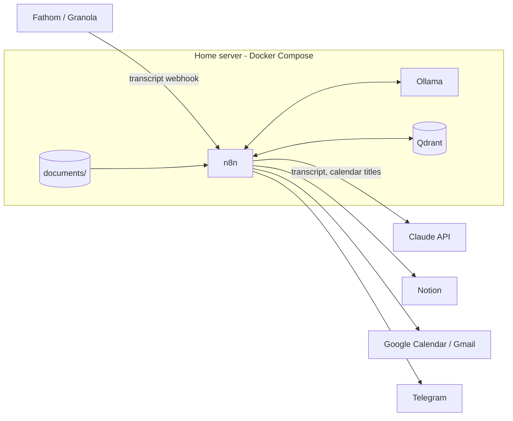
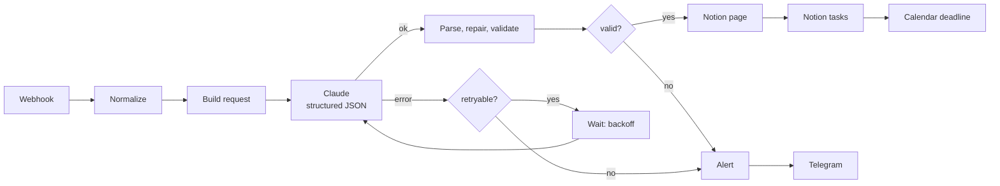
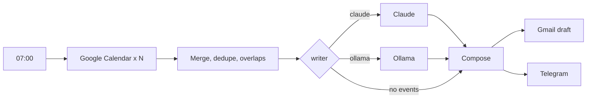
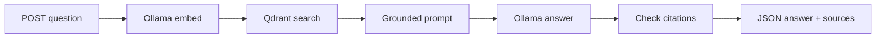
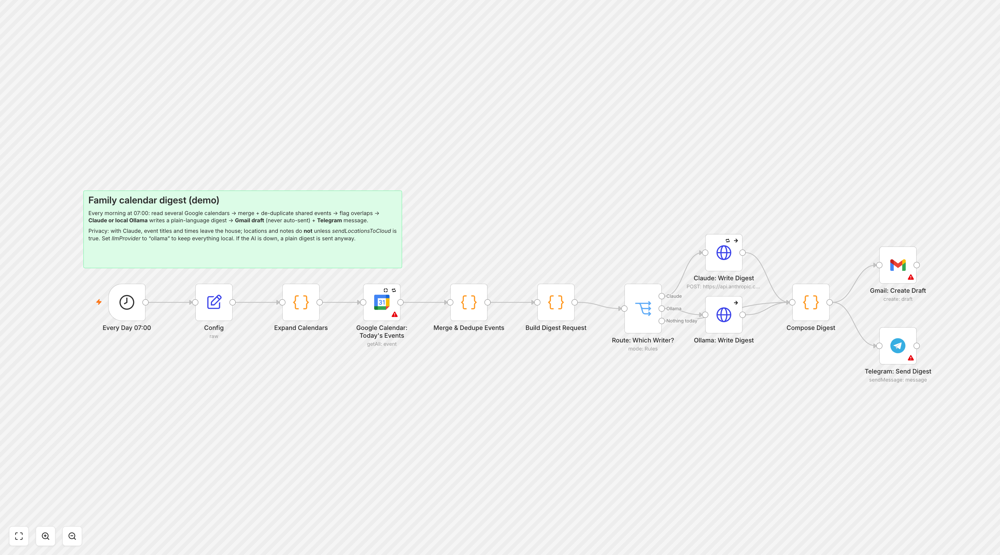
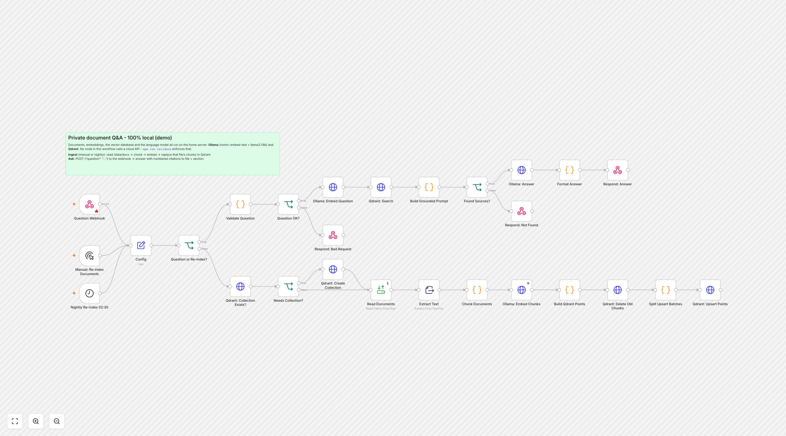
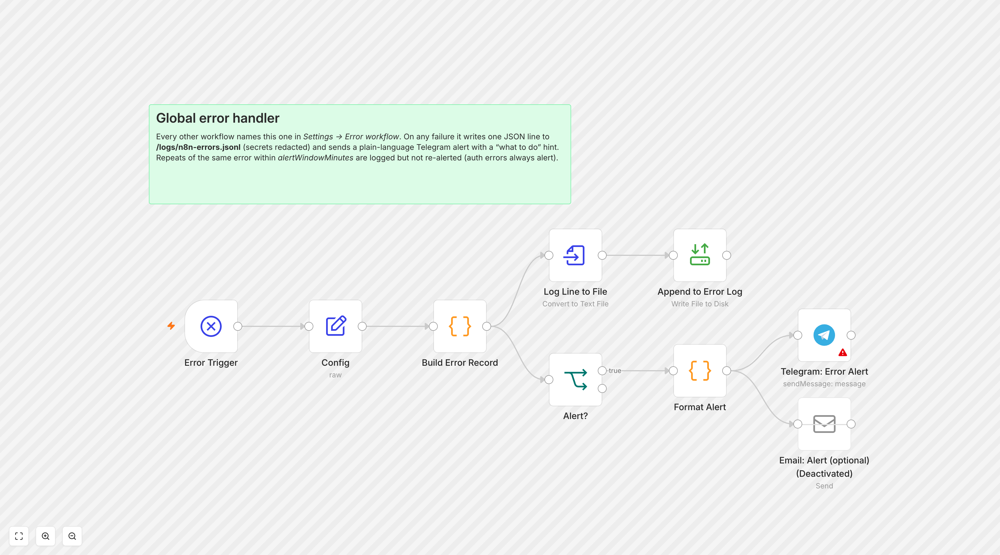

# n8n Home AI Workflows

[](https://github.com/sinnercode228/n8n-home-ai-workflows/actions/workflows/ci.yml)


Four n8n workflows that run on a Mac mini or small home server, deployed with Docker Compose. Each one handles errors, keeps private data at home, and has tests.

| Workflow | What it does |
|---|---|
| **[Meeting notes → Notion](workflows/meeting-notes-to-notion.json)** | A meeting-recorder webhook (Fathom or Granola style) sends the transcript to **Claude**, which returns the summary, decisions and action items (owners + due dates) as **strict JSON**. The JSON is validated, then written to a Notion page and one Notion task per action item. Dated items can also go to Google Calendar |
| **[Family calendar digest](workflows/family-calendar-digest.json)** | At 07:00: reads several Google calendars, removes duplicates and flags overlaps. Then **Claude or local Ollama** writes a plain-language digest, which becomes a **Gmail draft** and a **Telegram** message |
| **[Private document Q&A](workflows/private-doc-qa-local-llm.json)** | Answers questions about household documents, with citations, using **only local** Ollama + Qdrant. Documents never leave the house, and CI enforces it |
| **[Global error handler](workflows/error-handler.json)** | Every failure goes to a structured JSONL log (secrets redacted) and a plain-language Telegram alert, with duplicate alerts muted |

> **Demo project.** The household (the Alder family), people, documents and IDs are fictional. No real credentials are included. Placeholders look like `REPLACE_WITH_...`. The workflows were imported into n8n and checked by the validator and the tests in this repo. They have not been run against live Anthropic, Notion or Google accounts here. See [What was verified](#what-was-verified).


## Why it's built this way

- **Built for failures.** Claude calls retry on 429/5xx/529 with exponential backoff and jitter through a Wait loop, and 4xx errors go straight to an alert. Model output is validated and repaired before anything is written. The digest falls back to a rule-based version if the LLM is down. Every workflow is connected to a global error handler.
- **Privacy by design.** A diagram shows exactly [what goes to Claude and what stays local](docs/architecture.md#data-flow-what-stays-home-and-what-leaves). Calendar locations and notes don't go to the cloud unless you allow it. The document Q&A workflow is tagged `local-only`, and the validator fails if any node in it could reach a non-local host.
- **Code in the Code nodes is tested.** The JavaScript lives in `src/` as plain modules with unit tests. `npm run build` inlines it into the workflow JSON. The validator fails on drift, and the mock-run tests execute the **actual** `jsCode` from each workflow in a Node `vm` sandbox against sample payloads.
- **Current Claude API usage.** Messages API over HTTP Request, `output_config.format` (structured outputs), adaptive thinking (only `text` blocks are parsed), `stop_reason` checks for `refusal`/`max_tokens`, and optional server-side fallbacks. The model is set in each workflow's Config node (`claude-opus-5` by default).
- **Owner-friendly operations.** A [household runbook](docs/runbook.md) covers restart, backups, restore, rotating API keys, the encryption key, and what to do for each alert type.

## Architecture



Per-workflow diagrams and the full local-vs-cloud data flow are in **[docs/architecture.md](docs/architecture.md)**.

### Meeting notes → Notion



### Family calendar digest



### Private document Q&A (local only)



## Screenshots

| Meeting notes → Notion | Family calendar digest |
|---|---|
|  |  |
| **Private document Q&A** | **Error handler** |
|  |  |

## Setup

### 1. Start the stack

Requirements: Docker Desktop (or Docker Engine + Compose v2.20+), and about 10 GB of free disk for the local models.

```bash
git clone https://github.com/sinnercode228/n8n-home-ai-workflows.git home-automation
cd home-automation
cp .env.example .env
# Generate the encryption key, paste it into .env, and save a copy in your password manager:
openssl rand -hex 32
mkdir -p documents logs backups
docker compose up -d            # n8n + Ollama + Qdrant (COMPOSE_PROFILES in .env)
docker compose logs -f ollama-models   # first run: downloads nomic-embed-text + llama3.1:8b
```

Open http://localhost:5678 and create the n8n owner account.

> **Apple Silicon:** Docker can't use the Mac's GPU. For faster local answers, install the native [Ollama](https://ollama.com) app, remove `ollama` from `COMPOSE_PROFILES`, and set `ollamaBaseUrl` to `http://host.docker.internal:11434` in the Config nodes.

### 2. Import the workflows

Use the CLI. It keeps the workflow IDs, so every workflow stays connected to the error handler:

```bash
docker compose cp workflows n8n:/tmp/workflows
docker compose exec n8n n8n import:workflow --separate --input=/tmp/workflows
docker compose restart n8n
```

(UI alternative: *Workflows → Import from File* for each JSON. Then open each workflow's **Settings → Error workflow** and select "Global error handler".)

### 3. Create credentials

The workflows reference credentials **by name only**. Create them in n8n (**Credentials → Add**) with these names, or re-select them on each node after import:

| Credential name | n8n type | Used by |
|---|---|---|
| `Anthropic API key (x-api-key header)` | Header Auth: name `x-api-key`, value = your key | Meeting notes, Calendar digest |
| `Webhook shared secret (meeting recorder)` | Header Auth: e.g. `X-Webhook-Secret` + a random value | Meeting notes webhook |
| `Webhook shared secret (doc Q&A)` | Header Auth | Doc Q&A webhook |
| `Notion (household workspace)` | Notion API | Meeting notes |
| `Google Calendar (household)` | Google Calendar OAuth2 | Meeting notes, Calendar digest |
| `Gmail (household)` | Gmail OAuth2 | Calendar digest |
| `Telegram bot (household alerts)` | Telegram API | All (alerts, digest) |
| `SMTP (household alerts)` | SMTP (optional; email nodes are disabled by default) | Meeting notes, Error handler |

### 4. Fill in each workflow's Config node

Every workflow starts with a **Config** node (a Set node in JSON mode) that holds all settings: model, IDs, timezone, chat ID, and so on. Replace every `REPLACE_WITH_...` value. `npm run validate` lists how many are left.

**Notion databases** (share both with your integration):

- **Meetings**: `Name` (title), `Date` (date), `Source` (select), `Attendees` (text), `Recording` (URL)
- **Tasks**: `Name` (title), `Owner` (text), `Due` (date), `Priority` (select: high/normal/low), `Status` (select: To do), `Meeting` (relation → Meetings)

If your column names differ, re-pick the properties on the two Notion nodes.

### 5. Try it

```bash
# Meeting notes: send the sample Fathom-style payload
curl -X POST http://localhost:5678/webhook/meeting-notes \
  -H "X-Webhook-Secret: <your secret>" -H "Content-Type: application/json" \
  --data @samples/fathom-webhook.json

# Private Q&A: index samples/docs (copy them into documents/ first), then ask
cp -r samples/docs/* documents/
#   -> run "Manual: Re-index Documents" in the n8n editor, then:
curl -X POST http://localhost:5678/webhook/doc-qa \
  -H "X-Webhook-Secret: <your secret>" -H "Content-Type: application/json" \
  -d '{"question": "When is the boiler service due?"}'
```

Example Q&A response:

```json
{
  "ok": true,
  "question": "When is the boiler service due?",
  "answer": "The boiler needs its annual service every September or October [1]...",
  "grounded": true,
  "citations": [{ "n": 1, "path": "home/boiler.md", "heading": "Annual service", "score": 0.82, "excerpt": "..." }],
  "warnings": []
}
```

Then **activate/publish** the workflows. Backups: schedule `scripts/backup.sh` (see [runbook](docs/runbook.md#4-backups)).

## Development

```bash
npm run build        # inline src/ modules into the Code nodes of workflows/*.json
npm run validate     # static checks on every workflow (below)
npm test             # unit tests + mock runs of the real Code-node code
npm run check        # all of the above; this is what CI runs
```

`scripts/validate.mjs` checks each workflow for:

- valid JSON, required fields and `settings.executionOrder: v1`, and the workflow ships inactive
- unique node IDs and names; every connection targets an existing node on a valid output (IF/Switch output counts, error outputs only when `onError: continueErrorOutput`)
- no orphan nodes, and every `$('Node name')` reference resolves
- `settings.errorWorkflow` points at a workflow in this repo that has an Error Trigger
- webhooks have authentication and a `webhookId`, and HTTP nodes have timeouts
- Anthropic calls send `anthropic-version` and use a credential
- credentials are `{ "name": ... }` only, with no secret-looking strings anywhere (Anthropic, OpenAI, Notion, Telegram, Google, AWS, GitHub, Slack, JWT, private keys) and no literal `Authorization`/`x-api-key` values
- Code nodes compile and match `src/` exactly
- `local-only` workflows never call a non-local host

Edited a Code node in the n8n UI? Copy the change into `src/`, run `npm run build`, and commit both.

### Repository layout

```
workflows/            importable n8n workflow JSON (source of truth for the graph)
src/                  Code-node logic as plain, unit-tested JS modules
  shared/             JSON repair, LLM response parsing, backoff, redaction, alerts
  meeting/ calendar/ docqa/ errors/
scripts/
  build-workflows.mjs inline src/ into Code nodes (--check for CI)
  validate.mjs        workflow validator
  lib/code-nodes.mjs  Code node -> src module mapping
  backup.sh           nightly backup (workflows, encrypted credentials, volume)
tests/                node:test unit tests, vm mock runs, validator tests
samples/              webhook payloads, API responses, demo documents (fictional)
docs/                 architecture.md, runbook.md, screenshots/
deploy/Caddyfile      optional HTTPS + basic auth proxy
docker-compose.yml    n8n + Ollama + Qdrant (+ Caddy), healthchecks, volumes
```

## What was verified

- `npm run check`: the build is in sync, the validator passes with 0 errors, and all tests pass (unit, mock workflow runs, validator negative tests).
- All four workflows import into **n8n 2.40.6** with `n8n import:workflow --separate`. Their IDs, tags, `errorWorkflow` links and name-only credential references survive an export round-trip, and the Code-node code comes back byte-identical.
- The screenshots are the real n8n 2.40.6 editor canvas, captured from a throwaway local instance. The red triangles mean the credentials haven't been created yet, which is expected right after import.
- Node parameter names (Notion, Google Calendar, Gmail draft, Convert to File, Read/Write Files, Set, Webhook) were checked against the installed n8n node sources.
- `docker compose config` is valid with all profiles.
- **Not verified here:** live calls to Anthropic, Notion, Google or Telegram (no real accounts were used), and vendor webhook field names. The Fathom and Granola payloads in `samples/` are illustrative. Adjust `src/meeting/normalize-transcript.js` to match what your recorder actually sends.

## Need something like this?

I build n8n / AI automations and full-stack apps: integrations, LLM pipelines with proper error handling, and self-hosted setups.
GitHub **[@sinnercode228](https://github.com/sinnercode228)** · Telegram **[@sinnercode](https://t.me/sinnercode)**

---

## Кратко на русском

Демо-репозиторий из четырёх n8n-воркфлоу для домашнего сервера (Mac mini) на Docker Compose. Семья и данные вымышленные, реальных ключей нет.

- **Заметки встреч → Notion.** Вебхук с транскриптом (Fathom/Granola) отправляется в Claude, который возвращает строгий JSON: резюме, решения, задачи с ответственными и сроками. Дальше идут валидация и починка JSON, страница и задачи в Notion и события в Google Calendar. На ошибках — ретраи с экспоненциальной задержкой и алерт в Telegram.
- **Утренний дайджест календарей.** Несколько календарей объединяются, дубли убираются, пересечения отмечаются. Текст пишет Claude или локальная Ollama. Результат — черновик в Gmail (не отправляется) и сообщение в Telegram. Если LLM недоступна, уходит простой дайджест без ИИ.
- **Вопросы по личным документам.** Полностью локально (Ollama + Qdrant), ответы со ссылками на источники. Валидатор в CI гарантирует, что воркфлоу не обращается к облаку.
- **Глобальный обработчик ошибок.** Структурированный лог JSONL со скрытием секретов, понятный алерт с подсказкой, что делать, и защита от спама.

JS-код Code-нод лежит в `src/` и покрыт тестами. `npm run build` встраивает его в JSON, а `npm run check` запускает сборку, валидатор и тесты (то же самое делает CI). Для владельца есть понятный [runbook](docs/runbook.md): перезапуск, бэкапы, ротация ключей, что делать при сбое.

Связаться: GitHub [@sinnercode228](https://github.com/sinnercode228), Telegram [@sinnercode](https://t.me/sinnercode).

## License

MIT. See [LICENSE](LICENSE).
