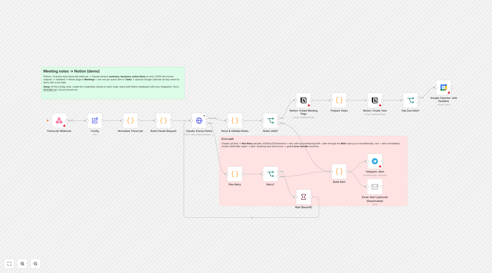

# n8n-home-ai-workflows

**English** · [Русский](README.ru.md)

[](https://github.com/sinnercode228/n8n-home-ai-workflows/actions/workflows/ci.yml)

Four n8n workflows for a home server running Docker Compose: meeting notes into Notion via Claude, a morning digest of the family calendars, answers about household documents from a local Ollama, and a shared error handler. Compose runs n8n 2.40.6 for them, plus Ollama, Qdrant and Caddy via profiles. The JavaScript in the Code nodes is generated from modules in `src/`, and the tests execute that code exactly as it sits in the workflow JSON.

I built this as a demo on invented data; it is not a client project. The Alder family, their calendars, the documents in `samples/docs/` and every ID are made up, and the e-mail addresses use the reserved `home.example` domain. There are no keys in the repo: every value you have to supply is spelled `REPLACE_WITH_...`, and `npm run validate` reports how many are left in each workflow.

This README is a lab notebook. For each workflow it lists what I actually ran, what I never ran, and how to connect real accounts. The short version: the JavaScript of all 18 Code nodes ran in a Node `vm` sandbox against hand-written files in `samples/`. None of the nodes that talk to Anthropic, Notion, Google, Telegram, Ollama or Qdrant has executed against a live service.

## The four workflows

| Workflow | Trigger | What it does | Services, models | Nodes / Code nodes |
|---|---|---|---|---|
| [`meeting-notes-to-notion`](workflows/meeting-notes-to-notion.json) | webhook `POST /webhook/meeting-notes` (header auth) | transcript → Claude → JSON with a summary, decisions and tasks → a page in the Notion Meetings database, one row per task in Tasks, an all-day Google Calendar event for each task with a due date; Telegram alert on failure | Claude Messages API, `claude-opus-5`; Notion; Google Calendar; Telegram | 18 / 6 |
| [`family-calendar-digest`](workflows/family-calendar-digest.json) | every day at 07:00 (`0 7 * * *`) | the day's events from four family calendars, deduplicated, overlaps flagged → text from the LLM, or from a template if the LLM fails → a Gmail draft and a Telegram message | Google Calendar; `claude-opus-5` or Ollama `llama3.1:8b`; Gmail; Telegram | 12 / 4 |
| [`private-doc-qa-local-llm`](workflows/private-doc-qa-local-llm.json) | webhook `POST /webhook/doc-qa` (header auth); re-index at 02:30 (`30 2 * * *`) and manually | answers a question from the `.md` and `.txt` files in the documents folder, with numbered citations to file and section | Ollama `nomic-embed-text` (768 dimensions) and `llama3.1:8b`; Qdrant | 27 / 6 |
| [`error-handler`](workflows/error-handler.json) | Error Trigger; the other three name it in `settings.errorWorkflow` | one line in `/logs/n8n-errors.jsonl` with keys and tokens masked, and a Telegram alert with a hint; the same error alerts at most once per 30 minutes | Telegram | 9 / 2 |

Node counts are from `npm run validate` (sticky notes excluded). All four are exported with `active: false`, and the validator rejects an active export.



The other canvases: [calendar digest](docs/screenshots/family-calendar-digest.png), [document Q&A](docs/screenshots/private-doc-qa-local-llm.png), [error handler](docs/screenshots/error-handler.png). The data-flow diagram and a per-workflow table of what leaves the house are in [`docs/architecture.md`](docs/architecture.md). Restarts, backups and key rotation for the household are in [`docs/runbook.md`](docs/runbook.md).

## What leaves the house

The meeting transcript goes to Anthropic in full, with the title, date and attendee names. For the calendar digest, Claude gets event titles, times, family member names and overlaps. Event locations and notes are only included if Config has `sendLocationsToCloud: true` (`src/calendar/digest.js:35`); with `llmProvider: "ollama"` the local model gets everything and nothing goes to an LLM outside the house. The `buildDigestRequest: privacy` unit test and the mock run of `Build Digest Request` check that the sample's locations stay out of the cloud request. The finished digest still goes to Gmail and Telegram.

The document Q&A workflow is tagged `local-only`. For workflows with that tag, [`scripts/validate.mjs`](scripts/validate.mjs) rejects cloud-service nodes (16 patterns in `CLOUD_NODE_TYPES`), substitutes the Config values into every HTTP node's URL, and accepts only local hosts such as `ollama`, `qdrant`, `localhost` and `host.docker.internal`; a URL in Config must pass the same test (`scripts/validate.mjs:263-278`). A negative test covers it (`tests/validator.test.mjs:51-59`). The limits of this check are listed under [Known limitations](#known-limitations). When the workflow fails, the node name and error text still go to Telegram through the error handler; [`redact.js`](src/shared/redact.js) masks keys and tokens in that text.

## What "ran" and "not tested" mean here

**Ran.** [`tests/harness.mjs`](tests/harness.mjs) pulls `jsCode` out of `workflows/*.json` and runs it with `vm.runInNewContext`, with fake `$input`, `$('Node')`, `$runIndex`, `$workflow`, `$execution` and `$getWorkflowStaticData` (`tests/harness.mjs:35-55`). [`tests/workflows.test.mjs`](tests/workflows.test.mjs) chains the Code nodes of each workflow and feeds them the files in `samples/` wherever a service response would be. The unit tests call the `src/` modules directly.

| File | Tests | What they cover |
|---|---|---|
| [`tests/unit.test.mjs`](tests/unit.test.mjs) | 33 | modules from `src/`: backoff, LLM response parsing, JSON repair, notes validation, the day window, chunking, citations, error fingerprints |
| [`tests/workflows.test.mjs`](tests/workflows.test.mjs) | 8 | mock runs of the real `jsCode` of all four workflows, including 429 → retry and 401 → alert without a retry |
| [`tests/validator.test.mjs`](tests/validator.test.mjs) | 7 | all workflows pass, and broken copies get caught: a broken connection, a key in a header, a credential in the JSON, a webhook without auth, a cloud host in `local-only`, Code node drift, an error output without `continueErrorOutput` |

**Not tested.** The node never executed inside n8n with a real service response; [`scripts/validate.mjs`](scripts/validate.mjs) checked its parameters statically (connections, `$('Node')` references, HTTP timeouts, credentials referenced by name only, webhook authentication, hard-coded keys). That covers every node that is not a Code node: the 11 HTTP Request nodes, Notion ×2, Google Calendar ×2, Gmail, Telegram ×3, Send Email ×2 (disabled), Wait, Read/Write Files ×2, Convert to File, Extract From File, Respond to Webhook ×3, the triggers, the Config (Set) nodes and the IF/Switch nodes. The service responses in `samples/` are hand-written, not captured from live APIs.

### How the Code nodes are built

n8n stores a Code node's code as a string, `parameters.jsCode`, inside the workflow JSON. Here all 18 of those strings are generated. The logic lives in `src/` as ES modules, and [`scripts/lib/code-nodes.mjs`](scripts/lib/code-nodes.mjs) maps modules to nodes, plus a short `entry` per node. The entry is the only place that touches `$input`, `$('Node')` and `$runIndex`.

`npm run build` ([`scripts/build-workflows.mjs`](scripts/build-workflows.mjs)) follows relative imports, puts dependencies before the modules that use them, strips `import` and `export`, and fails on an import cycle. `npm run check:build` exits with code 1 if any workflow differs from the build output, and `scripts/validate.mjs` compiles each Code node with `new vm.Script(...)` and compares it with what `src/` would produce. A change made in the n8n editor therefore has to be carried back into `src/` by hand, followed by `npm run build`.

## 1. Meeting notes → Notion

Chain: Transcript Webhook (answers 202 on receipt, `responseMode: onReceived`) → Config → Normalize Transcript → Build Claude Request → HTTP `Claude: Extract Notes` (`api.anthropic.com/v1/messages`) → Parse & Validate Notes → Notion: Create Meeting Page → Prepare Tasks → Notion: Create Task (one per action item) → Google Calendar: Add Deadline (all-day event) for tasks with a due date. Invalid notes and failed requests go to Build Alert → Telegram.

[`src/meeting/claude-request.js`](src/meeting/claude-request.js) builds the request: the model from Config (`claude-opus-5`), the notes JSON Schema in `output_config.format` (`src/meeting/claude-request.js:10-36`), `output_config.effort: "medium"` and `fallbacks: "default"`; both Claude HTTP nodes also send the header `anthropic-beta: server-side-fallback-2026-07-01`. [`llm-response.js`](src/shared/llm-response.js) takes text only from `text` blocks and treats `stop_reason: refusal` or `max_tokens` as an error (`src/shared/llm-response.js:25-46`); then nothing is written to Notion and an alert goes out. With structured outputs the text should parse as JSON directly; [`json-repair.js`](src/shared/json-repair.js) handles code fences, surrounding prose, smart quotes and trailing commas in case it doesn't. [`validate-notes.js`](src/meeting/validate-notes.js) then checks the content: without a `summary` no page is created; an impossible date such as `2026-02-30` or a due date before the meeting is cleared, a duplicate task is dropped, and each fix becomes a warning in the "Processing notes" block of the Notion page.

**The retry loop.** The error output of `Claude: Extract Notes` (`onError: continueErrorOutput`) leads to the Code node `Plan Retry`, then the IF node `Retry?` and `Wait (Backoff)`, which sends the request back into the same HTTP node. The header comment of [`src/shared/backoff.js`](src/shared/backoff.js) explains why:

> n8n's built-in "Retry On Fail" waits a fixed time (max 5 s) between tries. Rate limits (429) and overload (529) deserve real exponential backoff, and a 400/401 should not be retried at all - so the workflow loops through a Wait node using the plan computed here.

The loop retries 408, 409, 429, 500, 502, 503, 504, 529 and network errors without a status; anything else goes straight to a Telegram alert. The attempt count is not stored: the number of the failed attempt is `$runIndex + 1` of `Plan Retry`. The delay is random between exp/2 and exp, where exp = min(300, 10 · 2^(n−1)) s, so with `maxAttempts: 4` and `retryBaseSeconds: 10` from Config the waits are 5–10, 10–20 and 20–40 s, then an alert. Because the webhook has already answered 202, the sender does not wait through the delays.

What I ran (`tests/workflows.test.mjs:23-92`):

- `samples/fathom-webhook.json` → Normalize Transcript → Build Claude Request: the request has the model from Config, the `json_schema` format and the transcript with timestamps and speaker names.
- `samples/anthropic-meeting-response.json` (an empty thinking block, then the JSON in a text block) → Parse & Validate Notes → Prepare Tasks with a fake Notion page id: three tasks, owners matched to attendees, the task nobody took is `Unassigned`.
- `samples/anthropic-meeting-response-messy.json` (fenced JSON, a trailing comma, the date 2026-02-30, a due date before the meeting, a duplicate task) → repaired; two tasks remain, and the warnings reach the "Processing notes" text.
- Plan Retry: 429 on the first attempt → retry in 5–10 s with the Claude request carried through the Wait node; 529 on the last attempt → give up; 401 → no retry, and Build Alert produces Telegram HTML with the meeting title and the execution link.
- `samples/anthropic-refusal.json` → `ok: false` at stage `claude-response` → alert.
- Unit tests: `normalizeTranscript` on Fathom, Granola and generic payloads; the schema is closed and every field required, as structured outputs need (`tests/unit.test.mjs:143-154`); `validateMeetingNotes`; `planRetry` with an injected random; `redactSecrets`.

What I did not run:

- Any request to api.anthropic.com. I have not seen the API's answer to this exact request (`output_config.format`, `effort`, `fallbacks` and the beta header).
- The Wait → HTTP loop inside n8n. The attempt counter relies on n8n incrementing `$runIndex` of `Plan Retry` on every pass (`scripts/lib/code-nodes.mjs:34-48`), and on the HTTP node's error item carrying the status in one of the fields `statusFromError` reads (`src/shared/backoff.js:11-21`). The tests feed `Plan Retry` hand-made objects such as `{ error: { httpCode: 529 } }`.
- Both Notion nodes (property keys like `Due|date` and `Meeting|relation`, empty dates), Google Calendar: Add Deadline, Telegram: Alert, header auth on the webhook.
- Real Fathom and Granola payloads. The samples guess the field names (see the `_comment` in `samples/fathom-webhook.json` and `samples/granola-webhook.json`); the mapping is in one place, `src/meeting/normalize-transcript.js:55-89`.

Connecting real accounts:

1. Credentials: Anthropic, `Webhook shared secret (meeting recorder)`, Notion, Google Calendar, Telegram (exact names in [Credentials](#credentials)).
2. Two Notion databases shared with the integration. Meetings: title, `Date` (date), `Source` (select), `Attendees` (text), `Recording` (URL). Tasks: title, `Owner` (text), `Due` (date), `Priority` (select: high, normal, low), `Status` (select with a `To do` option), `Meeting` (relation to Meetings). If your columns are named differently, re-pick the properties in the two Notion nodes.
3. Config node: `notionMeetingsDbId`, `notionTasksDbId`, `telegramChatId`. Optional: `n8nBaseUrl` for execution links in alerts, `calendarId` (default `primary`), `createCalendarEvents: false` to skip calendar events, `maxAttempts` and `retryBaseSeconds`. `useServerFallbacks: false` removes `fallbacks` from the body, but the beta header is static in the HTTP node and stays.
4. First live run, with the workflow active:

   ```bash
   curl -X POST http://localhost:5678/webhook/meeting-notes \
     -H "X-Webhook-Secret: <secret>" -H "Content-Type: application/json" \
     --data @samples/fathom-webhook.json
   ```

   The header name is whatever you set in the Header Auth credential. The answer is an immediate 202, so check the result under Executions. The sample transcript has a task with no deadline (the smoke alarm batteries), so this run will most likely send an empty due date to Notion, which is the first thing to check.

## 2. Family calendar digest

Chain: Every Day 07:00 → Config → Expand Calendars (today's window in the family time zone, one item per calendar) → Google Calendar: Today's Events → Merge & Dedupe Events (shared events merged by `iCalUID` + start, cancelled ones dropped, overlaps flagged) → Build Digest Request → Route: Which Writer? (Claude, Ollama, or "Nothing today" without an LLM call) → Compose Digest → Gmail: Create Draft and Telegram: Send Digest.

`Claude: Write Digest` uses n8n's Retry On Fail (3 tries, 5 s apart) with `onError: continueRegularOutput`. If the LLM still fails, [`digest.js`](src/calendar/digest.js) builds the digest from a template and adds a line saying the AI writer was unavailable. Gmail gets a draft; nothing is sent by e-mail automatically.

[`day-window.js`](src/calendar/day-window.js) finds the UTC instant of local midnight in two passes, because the offset changes on days when the clocks change. A test checks that November 1, 2026 in `America/New_York` is 25 hours long.

What I ran (`tests/workflows.test.mjs:94-134`):

- `samples/google-calendar-events.json` (4 calendars, one event shared by two of them, one cancelled, one overlap) → Expand Calendars → Merge & Dedupe Events → Build Digest Request: 5 events, 1 overlap, and the dentist's location ("Maple St Dental") is not in the request to Claude.
- Compose Digest with `samples/ollama-digest-response.json`: the LLM text is used and the Telegram message is at most 4000 characters.
- Empty day: route `none`, no LLM call, and the e-mail says "Nothing is on the family calendar".
- Unit tests: the day window, including the 25-hour day (`tests/unit.test.mjs:207-214`); `mergeEvents`; the privacy split between Claude and Ollama; the template fallback after an `ECONNREFUSED` error.

What I did not run:

- Google Calendar: Today's Events. Merge & Dedupe Events assigns each event to a family member through `pairedItem` (`scripts/lib/code-nodes.mjs:108-119`); I have not seen the node's real `pairedItem` output, nor what `alwaysOutputData` emits for an empty calendar (the test fakes it as `{}`). The node asks for `orderBy: startTime` and leaves recurring-event handling at the node default, while the sample assumes `singleEvents=true`. If Google rejects that ordering, drop `orderBy`: `mergeEvents` sorts on its own (`src/calendar/merge-events.js:54`).
- The Claude branch with a real reply. There is no sample Claude digest response; the Compose Digest run uses the Ollama sample, and Anthropic text parsing is covered by a hand-written `content` array (`tests/unit.test.mjs:62-69`).
- Ollama: Write Digest, Gmail: Create Draft (`sendTo` option), Telegram: Send Digest.
- Whether Retry On Fail with `continueRegularOutput` really hands Compose Digest an item with an `error` field after the last try, instead of stopping the run.

Connecting real accounts:

1. Credentials: `Google Calendar (household)`, `Gmail (household)`, `Telegram bot (household alerts)`; the Anthropic one only with `llmProvider: "claude"`.
2. Config node: the four calendar ids (`member` is the name shown next to that calendar's events), `telegramChatId`, `digestEmailTo`, `familyName`, `timezone`, `llmProvider` (`"claude"` or `"ollama"`), `sendLocationsToCloud`.
3. To avoid waiting until 07:00, use Execute workflow in the editor. That is a real run: it creates the Gmail draft and sends the Telegram message.

## 3. Household document Q&A (local)

Re-index (manual trigger or `30 2 * * *`): Qdrant: Collection Exists? → create it if missing (768 dimensions, cosine) → Read Documents (`/data/docs/**/*.{md,txt}`) → Extract Text → Chunk Documents (1200 characters, 200 overlap, nearest Markdown heading kept) → Ollama `/api/embed` per chunk → Build Qdrant Points (deterministic ids) → Qdrant: Delete Old Chunks for those files → upsert in batches of 64.

Question: `POST /webhook/doc-qa` → Validate Question (400 on a missing or over-long question) → embed → Qdrant search (`topK` 6) → Build Grounded Prompt → Ollama `/api/chat` → Format Answer → JSON response. Hits below `minScore` 0.35 are dropped; if none are left, the LLM is not called and the webhook answers with `grounded: false`. [`rag.js`](src/docqa/rag.js) removes `[n]` citations to sources that do not exist, which small local models sometimes invent, and records a warning. Response shape: `{ ok, question, answer, grounded, citations: [{ n, path, heading, score, excerpt }], warnings, model }`.

What I ran (`tests/workflows.test.mjs:136-168`):

- The three files in `samples/docs/` through Chunk Documents with faked binary metadata (`fileName`, `directory`): paths come out relative to `/data/docs`, headings are kept.
- Embeddings faked as 8-dimension arrays → Build Qdrant Points → Split Upsert Batches.
- A question → Validate Question → Build Grounded Prompt on `samples/qdrant-search-response.json` (the hit with score 0.21 is dropped) → Format Answer on `samples/ollama-answer-response.json`: `grounded: true`, first citation `home/boiler.md`.
- Unit tests: `chunkDocument` on `boiler.md`, batching by 64 (70 points → 64 + 6), `normalizeQuestion`, `buildRagRequest`, and `formatAnswer`, which removes the invented `[7]` from the same sample with a warning.

What I did not run:

- Ollama and Qdrant themselves. The response shapes of `/api/embed` (the code reads `embeddings[0]`), `/collections/{name}/exists`, `/points/delete`, `/points?wait=true` and `/points/search` come from documentation.
- Read/Write Files and Extract From File: whether `binary.data.directory` and `fileName` arrive in the form Chunk Documents expects (`scripts/lib/code-nodes.mjs:144-159`), whether the `{md,txt}` glob matches, and whether `N8N_RESTRICT_FILE_ACCESS_TO` in `docker-compose.yml` lets `/data/docs` through.
- The three Respond to Webhook nodes and header auth on the webhook.
- Answer quality of `llama3.1:8b` on real documents; I have not measured it.

Trying it is the quickest of the four, because it needs one credential, `Webhook shared secret (doc Q&A)` (Header Auth), and no external accounts. With the stack running and the models pulled (see [Setup](#setup)):

```bash
cp -r samples/docs/* documents/
# in the editor: run "Manual: Re-index Documents", then activate the workflow
curl -X POST http://localhost:5678/webhook/doc-qa \
  -H "X-Webhook-Secret: <secret>" -H "Content-Type: application/json" \
  -d '{"question": "When is the boiler service due?"}'
```

The Config node has no placeholders. On Apple Silicon, Docker does not use the GPU, so [`docker-compose.yml`](docker-compose.yml) suggests a native Ollama: remove `ollama` from `COMPOSE_PROFILES` and set `"ollamaBaseUrl": "http://host.docker.internal:11434"` in the Config node; the validator counts that host as local.

## 4. Error handler

Chain: Error Trigger → Config → Build Error Record → Log Line to File → Append to Error Log (`/logs/n8n-errors.jsonl`); in parallel Alert? → Format Alert → Telegram: Error Alert (plus a disabled e-mail node). [`error-record.js`](src/errors/error-record.js) builds the record and the alert decision. The fingerprint is made of the workflow id, the node name and the message with digits replaced by `#`; a repeat within `alertWindowMinutes` (30) is logged but not alerted. Errors with severity `high` (401, 403, credentials) always alert.

The other three workflows point to it with `settings.errorWorkflow: "HmErrorHandler01"`. The validator requires that this id belongs to a workflow in the repo with an Error Trigger, and that the handler itself names no error workflow, to avoid loops (`scripts/validate.mjs:118-127`).

What I ran (`tests/workflows.test.mjs:170-188`):

- `samples/error-trigger.json` (a 401 with a fake key in the message) → Build Error Record: alert on, the key absent from the log line, the fingerprint stored in static data → Format Alert: HTML with the key-rotation hint and the execution link.
- Unit tests: `buildErrorRecord` (severity `high`, redaction, execution vs trigger errors) and `shouldAlert` (a repeat after 10 minutes is muted, after 31 minutes it alerts, `high` always alerts).

What I did not run:

- A real Error Trigger payload from n8n 2.x. The sample is hand-written; the code reads both `execution.error` and `trigger.error` (`src/errors/error-record.js:24-29`).
- Writing to `/logs` through Convert to File with append, and the permissions of `./logs` on a Linux host.
- Static data surviving between runs; Telegram: Error Alert.

Connecting real accounts: the `Telegram bot (household alerts)` credential and `telegramChatId` in Config. Each JSON file carries a fixed workflow id (`HmErrorHandler01` for this one), and `errorWorkflow` refers to it, so import with the CLI commands in [Setup](#setup). After importing, check in each workflow's settings that Error workflow shows "Global error handler", and pick it there if it doesn't (for example after an import through the UI).

## Credentials

Nodes reference credentials by name, so create them in n8n (Credentials → Add) with exactly these names. API keys go here, encrypted with `N8N_ENCRYPTION_KEY`, not into `.env`.

| Credential name | Type | Used by |
|---|---|---|
| `Anthropic API key (x-api-key header)` | Header Auth, header `x-api-key` | meeting notes; digest with `llmProvider: "claude"` |
| `Webhook shared secret (meeting recorder)` | Header Auth, e.g. `X-Webhook-Secret` and a random string | meeting notes webhook |
| `Webhook shared secret (doc Q&A)` | Header Auth | document Q&A webhook |
| `Notion (household workspace)` | Notion API | meeting notes |
| `Google Calendar (household)` | Google Calendar OAuth2 | meeting notes, digest |
| `Gmail (household)` | Gmail OAuth2 | digest |
| `Telegram bot (household alerts)` | Telegram API | meeting notes, digest, error handler |
| `SMTP (household alerts)` | SMTP | only if you enable the disabled e-mail nodes |

Then replace the 9 `REPLACE_WITH_...` values in the Config nodes: the Telegram chat id in three workflows, two Notion database ids and four calendar ids. With the `proxy` profile, webhooks bypass Caddy's basic auth and rely on these shared-secret headers ([`deploy/Caddyfile`](deploy/Caddyfile)).

## Setup

Checks without Docker or accounts, on Node.js 22 or newer (`package.json` has no dependencies):

```bash
npm run check         # check:build, validate and the 48 tests: the same steps CI runs
npm run build         # regenerate parameters.jsCode in workflows/*.json from src/
npm run validate      # scripts/validate.mjs over all workflows
npm test              # node --test "tests/**/*.test.mjs"
```

The full stack needs Docker with Compose v2; the runbook estimates about 8 GB of RAM for the default local model while it answers:

```bash
git clone https://github.com/sinnercode228/n8n-home-ai-workflows.git home-automation
cd home-automation
cp .env.example .env                    # set N8N_ENCRYPTION_KEY: openssl rand -hex 32
mkdir -p documents logs backups
docker compose up -d                    # n8n + the profiles in COMPOSE_PROFILES (ollama,qdrant in the example)
docker compose logs -f ollama-models    # first start: pulls nomic-embed-text and llama3.1:8b, then exits
```

Open http://localhost:5678, create the owner account, then import the workflows:

```bash
docker compose cp workflows n8n:/tmp/workflows
docker compose exec n8n n8n import:workflow --separate --input=/tmp/workflows
docker compose restart n8n
```

Then create the credentials, fill the Config nodes and activate the workflows you need. Execute workflow in the editor is a real run, including the Gmail draft and Telegram messages.

- The editor port is published on `127.0.0.1` only. File nodes are limited to `/data/docs` (the documents folder, mounted read-only) and `/logs` (`N8N_RESTRICT_FILE_ACCESS_TO` in `docker-compose.yml`).
- The `proxy` profile puts Caddy in front of the editor with HTTPS and basic auth on everything except `/webhook/*`, `/webhook-test/*` and `/healthz`, and publishes ports 80 and 443.
- [`scripts/backup.sh`](scripts/backup.sh) exports the workflows and the credentials (still encrypted), then stops n8n for the few seconds of the volume snapshot (`scripts/backup.sh:32-39`); a webhook arriving in that window is refused. Restore steps are in the runbook.
- If you edit a Code node in the n8n editor, port the change to `src/` and run `npm run build`, or the validator reports drift.

## Known limitations

Found by reading and running the code, not fixed yet. Most need a live account to fix and verify properly.

1. **A re-delivered transcript creates duplicates.** `meetingId` is computed (`src/meeting/normalize-transcript.js:80`) but nothing checks it, so a second delivery creates a second meeting page and a second set of tasks. The webhook answers 202 before processing starts, so the sender never learns that a run failed and can only resend everything.
2. **Empty dates sent to Notion are untested.** A task without a due date sends `''` to `Due|date` (node "Notion: Create Task" in `workflows/meeting-notes-to-notion.json`); a meeting without a start time sends `date: null` (`src/meeting/notion-content.js:24`). Validation also clears invalid and past due dates (`src/meeting/validate-notes.js:60-67`), so undated tasks are common. I have not checked what the n8n Notion node does with either value.
3. **Task owners are matched by first name.** If the model's owner is not an exact attendee name, the first attendee with the same first word wins (`src/meeting/validate-notes.js:19-26`), so two attendees with the same first name can be confused.
4. **Deleted documents stay searchable.** Re-indexing deletes old chunks only for the paths found in the current run (`src/docqa/chunk.js:66-70`). A file removed from `documents/` keeps showing up in answers until the Qdrant collection is dropped by hand.
5. **A failed upsert leaves a gap.** Qdrant: Delete Old Chunks runs before Qdrant: Upsert Points (`workflows/private-doc-qa-local-llm.json`). If the upsert fails, those files are missing from search until the next successful re-index.
6. **Long text without spaces is silently cut.** A paragraph longer than `chunkChars` is split by a regex that needs whitespace at most `chunkChars - chunkOverlap` (1000) characters apart (`src/docqa/chunk.js:38`). From a longer stretch without whitespace (a long URL, base64, a table without spaces) only the last 1000 characters are kept: "word " + 3000 × "x" + " end" becomes one 1012-character chunk. I checked this by calling `chunkDocument` directly; no test covers it.
7. **Only `.md` and `.txt`, one request per chunk.** `docsGlob` in the Config node is `/data/docs/**/*.{md,txt}` and Extract From File runs in text mode, so PDFs and scans are not indexed. Ollama: Embed Chunks sends one `/api/embed` request per chunk, so a large folder means as many requests as chunks.
8. **The vector size is fixed when the collection is created.** `embedDims: 768` matches `nomic-embed-text`, and the collection is only created when it does not exist (node "Needs Collection?"). Switching the embedding model means changing the number and deleting the collection by hand. The tests use 8-dimension vectors (`tests/workflows.test.mjs:150`), so nothing checks 768.
9. **Ollama and Qdrant images are not pinned.** `OLLAMA_IMAGE_TAG=latest` and `QDRANT_IMAGE_TAG=latest` (`.env.example:6-7`), while n8n is pinned to 2.40.6. Search uses Qdrant's `/points/search`, which is worth re-checking after pulling a new `latest`.
10. **The time zone is set in three places.** `TIMEZONE` in `.env` (passed as `GENERIC_TIMEZONE` in `docker-compose.yml`), `settings.timezone` in each workflow JSON (used by the schedules; the validator warns when it is missing, `scripts/validate.mjs:95`), and `timezone` in the Config nodes (the digest's day window, `src/calendar/day-window.js:27-34`). If they disagree, the digest covers the wrong day.
11. **The `local-only` check has blind spots.** It looks at node types, HTTP node URLs and Config URLs (`scripts/validate.mjs:263-278`), not at the body of Code nodes and not at URLs changed in the editor after import. The hard-coded secret check is a list of regexes (`scripts/validate.mjs:28-41`); a key in another format passes.
12. **The error handler has blind spots of its own.** Alert de-duplication keeps its state in workflow static data (`scripts/lib/code-nodes.mjs:203-208`), which n8n keeps between production runs only, so manual test runs alert every time. If the handler itself fails (for example, `./logs` is not writable from the container), that shows only in Executions: by validator rule it has no error workflow (`scripts/validate.mjs:125-127`).

## Check log

- 2026-10-02, macOS, Node 25.8.2: `npm run check:build` → "Code nodes are in sync with src/."; `npm run validate` → 4 workflows, 0 errors, 0 warnings; `npm test` → 48 tests, all passing.
- CI ([`.github/workflows/ci.yml`](.github/workflows/ci.yml)) runs the same three steps on Node 22 and 24; on 24 it also runs `docker compose config -q` with all three profiles and `bash -n scripts/backup.sh` (`.github/workflows/ci.yml:33-39`). No container is started in CI, and `backup.sh` is only syntax-checked.
- The screenshots in `docs/screenshots/` are the n8n editor after importing the four JSON files.
- Never done: requests from these workflows to api.anthropic.com, Notion, Google Calendar, Gmail, Telegram, Ollama or Qdrant.

## Repository layout

```
workflows/            the four JSON files to import into n8n
src/                  Code node logic as ES modules
  shared/             json-repair, llm-response, backoff, redact, alert, text
  meeting/ calendar/ docqa/ errors/
scripts/
  build-workflows.mjs writes src/ into the Code nodes (--check for CI)
  validate.mjs        static workflow validator
  lib/code-nodes.mjs  map of Code node -> modules + entry snippet
  backup.sh           backup: workflows, encrypted credentials, n8n volume
tests/                unit.test.mjs, workflows.test.mjs (vm), validator.test.mjs, harness.mjs
samples/              webhook payloads, API responses, demo documents (all invented)
docs/                 architecture.md, runbook.md, screenshots/
deploy/Caddyfile      optional HTTPS + basic auth in front of the editor
docker-compose.yml    n8n + Ollama + Qdrant (+ Caddy), healthchecks, volumes
```

---

Author: Грешный Котик ([@sinnercode228](https://github.com/sinnercode228) on GitHub). I take freelance work like this: Telegram [@sinnercode](https://t.me/sinnercode). License: [MIT](LICENSE).
