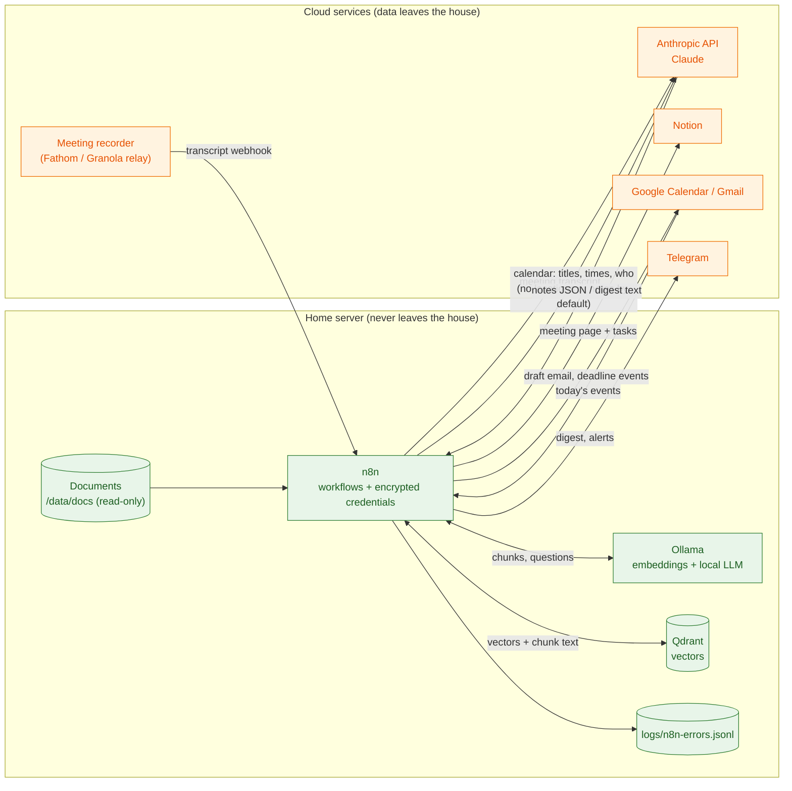
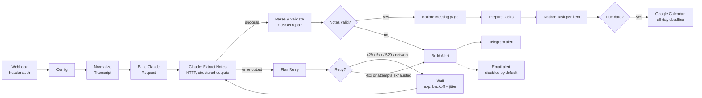
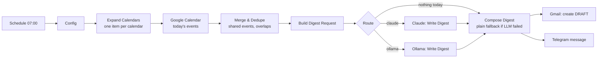
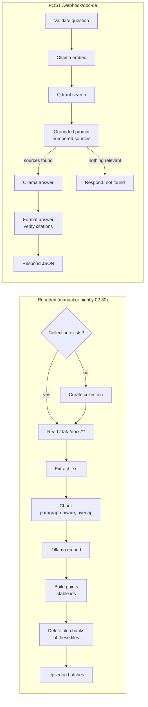

# Architecture

> Demo project with a fictional household (the Alder family). The design is
> meant to be copied for a real home or small office.

## What runs where

Everything runs on one always-on machine at home (a Mac mini or a small Linux box) under Docker Compose:

| Service | Role | Reachable from |
|---|---|---|
| **n8n** | Runs the workflows, stores credentials (encrypted) and run history | `127.0.0.1:5678` only; add the optional Caddy proxy or Tailscale to reach it from outside |
| **Ollama** | Local LLM (`llama3.1:8b`) and embeddings (`nomic-embed-text`) | Docker network only (`http://ollama:11434`) |
| **Qdrant** | Vector database for document Q&A | Docker network only (`http://qdrant:6333`) |
| **Caddy** (optional) | HTTPS plus a second password on the n8n editor | ports 80/443 |

On Apple Silicon, Docker containers cannot use the GPU. For better Ollama speed, install the native Ollama app and set `ollamaBaseUrl` in the workflows' Config nodes to `http://host.docker.internal:11434`. The validator accepts that host as local.

## Data flow: what stays home and what leaves



Per workflow:

| Workflow | Sent to Claude (Anthropic) | Never leaves the home server |
|---|---|---|
| Meeting notes -> Notion | The meeting transcript, title, date and attendee names | Credentials. Run history stays in n8n |
| Family calendar digest (`llmProvider: "claude"`) | Event titles, times and family member names | Locations and event descriptions, unless `sendLocationsToCloud: true` |
| Family calendar digest (`llmProvider: "ollama"`) | Nothing | Everything. Only the finished digest goes to Gmail and Telegram |
| Private document Q&A | Nothing, ever | Documents, chunks, vectors, questions and answers |
| Error handler | Nothing | The structured log. The Telegram alert has redacted text only |

The "never" for document Q&A is enforced in code. The workflow is tagged `local-only`, and `scripts/validate.mjs` fails CI if any HTTP node in it resolves to a host outside `ollama`, `qdrant`, `localhost` or `host.docker.internal`, or if a cloud-service node is added.

## Workflow internals

### Meeting notes -> Notion



- **Structured outputs.** The request sets `output_config.format` to a JSON schema, so Claude's answer must match that shape. The parse step still validates it and can repair it, because the same code is used when the model is swapped for a local one.
- **Adaptive thinking.** Adaptive thinking is on by default for the configured model, and responses can start with `thinking` blocks. The parser reads only the `text` blocks. It checks `stop_reason` (`refusal`, `max_tokens`) before it trusts the content.
- **Server-side fallbacks.** When `useServerFallbacks` is true (the default), the request sends `fallbacks: "default"` with the `server-side-fallback-2026-07-01` beta header. If the model declines the request, the API retries it on Anthropic's recommended fallback model instead of failing the run. When that happens, the Notion page gets a warning line.
- **Validation.** Owners are matched to attendee names. Impossible or past due dates are removed. Duplicate tasks are dropped. Every fix is listed on the page under **Processing notes**, so nothing is changed silently.
- **Retries.** n8n's built-in retry waits a fixed time. Rate limits and overload errors need real backoff, so the error output goes to a Wait node loop. The attempt count comes from `$runIndex`.

### Family calendar digest



- "Today" is worked out in the household's timezone. The window is DST-safe and unit-tested on the 25-hour day in November.
- An event shared on several calendars appears once, with every family member it belongs to.
- If the LLM is down, the family still gets a plain, rule-based digest, with a note saying so.
- Gmail gets a **draft**. Nothing is emailed automatically.

### Private document Q&A (local)



- Chunk ids are deterministic, so re-indexing replaces a file's chunks instead of duplicating them. If a file got shorter, its stale chunks are deleted first.
- Low-score hits are dropped before the prompt is built. If nothing relevant is found, the local model is not called, which prevents confident answers built on irrelevant text.
- Citations like `[7]` that point at a source that doesn't exist are removed, and the response includes a warning about them.

### Global error handler

Every workflow sets `settings.errorWorkflow` to the error handler. The validator requires this. On any failure the handler:

1. Builds a structured record: workflow, execution link, failed node, severity, a fingerprint, and a plain-language hint. Tokens and keys are redacted.
2. Appends it as one JSON line to `logs/n8n-errors.jsonl`.
3. Sends a Telegram alert, unless the same error already alerted in the last 30 minutes. Auth errors always alert.

## Code organisation

The JavaScript in every Code node is **generated**:

```
src/**/*.js  --(npm run build)-->  workflows/*.json  (parameters.jsCode)
     |                                  |
  unit tests                     validator: compiles + matches src/ exactly
                                 mock-run tests: execute the real jsCode in a vm
```

- `scripts/lib/code-nodes.mjs` maps each Code node to its `src/` module and a small n8n entry snippet (the only part that touches `$input` and `$('Node')`).
- `npm run check` runs `check:build` (no drift), `validate` and `test`. CI runs the same steps.
- If someone edits a Code node in the n8n UI, the validator reports the drift. Port the change back to `src/` and rebuild.
